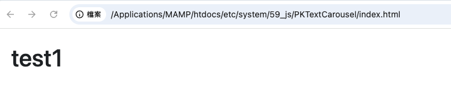

---

# PKTextCarousel

`PKTextCarousel` is a lightweight, customizable text carousel class built with jQuery. It supports multiple independent instances, various animation types, and flexible configurations. Ideal for banners, notifications, or cycling through headlines.

---

## 📦 Features

* Supports multiple independent instances
* Built-in animations: `fade`, `slide`, `scale`
* Customizable direction for sliding (`up`, `down`, `left`, `right`)
* Auto-start and looping options
* Callback functions for text change and completion
* Manual controls: next, previous, jump-to-index

---

## 🔧 Installation

Make sure jQuery is included in your project, then load the `PKTextCarousel` class.

```html
<script src="https://code.jquery.com/jquery-3.6.0.min.js"></script>
<script src="pk-text-carousel.js"></script>
```

---

## 🚀 Usage

### HTML Structure

```html
<div id="text-carousel"></div>
```

### JavaScript Initialization

```javascript
const carousel = new PKTextCarousel({
  selector: '#text-carousel',
  textArray: ['Welcome', 'Latest News', 'Join Us'],
  interval: 2000,
  fadeOutTime: 300,
  fadeInTime: 300,
  animationType: 'slide', // Options: 'fade', 'slide', 'scale'
  direction: 'up',
  autoStart: true,
  loop: true,
  onTextChange: (text, index) => {
    console.log('Text changed:', text, index);
  },
  onComplete: () => {
    console.log('Carousel completed.');
  }
});
```

---

## ⚙️ Configuration Options

| Option          | Type       | Default          | Description                                            |
| --------------- | ---------- | ---------------- | ------------------------------------------------------ |
| `selector`      | `string`   | `#text-carousel` | Target DOM selector                                    |
| `textArray`     | `array`    | `['Loading...']` | Array of texts to display                              |
| `interval`      | `number`   | `3000`           | Time between transitions (ms)                          |
| `fadeOutTime`   | `number`   | `250`            | Fade-out duration (ms)                                 |
| `fadeInTime`    | `number`   | `250`            | Fade-in duration (ms)                                  |
| `animationType` | `string`   | `'fade'`         | Animation style: `'fade'`, `'slide'`, `'scale'`        |
| `direction`     | `string`   | `'up'`           | Slide direction: `'up'`, `'down'`, `'left'`, `'right'` |
| `autoStart`     | `boolean`  | `true`           | Auto start on initialization                           |
| `loop`          | `boolean`  | `true`           | Whether to loop the carousel                           |
| `onTextChange`  | `function` | `null`           | Callback triggered on text change                      |
| `onComplete`    | `function` | `null`           | Callback triggered after final text (if not looping)   |

---

## 🧩 API Methods

```javascript
carousel.start();               // Start the carousel
carousel.stop();                // Stop the carousel
carousel.nextText();            // Move to the next text
carousel.prevText();            // Move to the previous text
carousel.goTo(index);           // Jump to a specific index
carousel.updateTextArray(arr); // Replace the text array
carousel.getCurrentText();      // Get the current displayed text
carousel.getCurrentIndex();     // Get the current index
carousel.destroy();             // Reset styles and stop
```

---

## 🔗 Compatibility

* Requires jQuery 3.x or later
* Works in all modern browsers (Chrome, Edge, Firefox, Safari)


---

## 📄 Example

See `index.html` for a working demo, or contact the author for further integration help.

---

## 🖼️ Screenshot



---

如需我協助產出 `index.html` 範例頁面，也可以告訴我。


---

## 📝 License & Author

* Author: PK
* License: MIT
 
## 💡 Support This Project

If you find this project helpful, please consider supporting the author **Powen Ko**.  
Your donation helps maintain and improve open-source software, create high-quality tutorials, and contribute to the developer community.

[](https://www.paypal.com/ncp/payment/4W7NYVPYLUHBQ)


---

# PKTextCarousel

`PKTextCarousel` 是一款輕量級、可配置的文字輪播元件，使用 jQuery 操作 DOM，支援多種動畫與多實例管理，適用於各類網頁展示情境。

---

## 📦 功能特色

* 支援多實例獨立配置
* 支援 `fade`、`slide`、`scale` 等動畫類型
* 可設定輪播方向（上 / 下 / 左 / 右）
* 可自動播放與循環播放
* 支援文字切換與播放結束的回調函式
* 可手動控制前一筆 / 下一筆 / 指定索引

---

## 🔧 安裝方式

請確認你的專案中已經載入 **jQuery**，然後將 `PKTextCarousel` 原始碼匯入你的 JS 檔案中或使用 `<script>` 載入。

```html
<script src="https://code.jquery.com/jquery-3.6.0.min.js"></script>
<script src="pk-text-carousel.js"></script>
```

---

## 🚀 使用方法

### HTML 結構

```html
<div id="輪播文字"></div>
```

### JavaScript 初始化

```javascript
const carousel = new PKTextCarousel({
  selector: '#輪播文字',
  textArray: ['歡迎光臨', '最新消息', '加入我們'],
  interval: 2000,
  fadeOutTime: 300,
  fadeInTime: 300,
  animationType: 'slide', // 'fade', 'slide', 'scale'
  direction: 'up',
  autoStart: true,
  loop: true,
  onTextChange: (text, index) => {
    console.log('文字變更:', text, index);
  },
  onComplete: () => {
    console.log('輪播已完成');
  }
});
```

---

## ⚙️ 配置選項（Options）

| 參數名稱            | 類型         | 預設值              | 說明                              |
| --------------- | ---------- | ---------------- | ------------------------------- |
| `selector`      | `string`   | `#輪播文字`          | 指定要套用輪播效果的 DOM 選擇器              |
| `textArray`     | `array`    | `['Loading...']` | 輪播顯示的文字陣列                       |
| `interval`      | `number`   | `3000`           | 每次輪播間隔時間（毫秒）                    |
| `fadeOutTime`   | `number`   | `250`            | 淡出動畫時間（毫秒）                      |
| `fadeInTime`    | `number`   | `250`            | 淡入動畫時間（毫秒）                      |
| `animationType` | `string`   | `'fade'`         | 動畫類型：`fade`、`slide`、`scale`     |
| `direction`     | `string`   | `'up'`           | 滑動方向：`up`、`down`、`left`、`right` |
| `autoStart`     | `boolean`  | `true`           | 是否初始化時自動開始播放                    |
| `loop`          | `boolean`  | `true`           | 是否循環播放                          |
| `onTextChange`  | `function` | `null`           | 每次文字變更時觸發                       |
| `onComplete`    | `function` | `null`           | 所有文字播放完畢後觸發（非 loop 模式）          |

---

## 🧩 API 方法

```javascript
carousel.start();               // 開始輪播
carousel.stop();                // 停止輪播
carousel.nextText();            // 顯示下一個文字
carousel.prevText();            // 顯示上一個文字
carousel.goTo(index);           // 顯示指定索引的文字
carousel.updateTextArray(arr); // 更新文字陣列
carousel.getCurrentText();      // 取得目前顯示的文字
carousel.getCurrentIndex();     // 取得目前索引
carousel.destroy();             // 銷毀並清除樣式
```

---

## 🔗 環境支援

* 必須依賴 jQuery 3.x 或以上版本
* 適用於現代瀏覽器（Chrome, Edge, Firefox, Safari）

---

## 📝 授權與作者

* 作者：PK
* 授權：MIT License

---
##  範例 
請參考 `index.html` 或進一步聯絡作者。
 


## 螢幕截圖 


## 📬 聯絡方式

如有錯誤或功能建議，歡迎透過 GitHub Issue 或信箱聯絡作者柯博文老師 www.powenko.com。

```
## 💡 支持這個專案

如果您覺得這個專案對您有幫助，歡迎支持作者 **Powen Ko**。  
您的捐款將協助我們持續維護與改進開源工具，創作高品質的教學內容，並推動技術社群的成長。

[](https://www.paypal.com/ncp/payment/4W7NYVPYLUHBQ)
